## Actividades

| #   | Actividad                               | Encargado                          |
| --- | --------------------                    | --------------                     |
| 1   | REGISTRO DE QUEJAS/RECLAMOS/SUGERENCIAS | Solicitante                        |
| 2   | CLASIFICAR QUEJAS/RECLAMOS/SUGERENCIAS  | 
Pendiente
 |
| 3   | ANALIZAR QUEJA/RECLAMO/SUGERENCIA                    | 
Pendiente
 |
| 4   | DAR RESPUESTA QUEJA/RECLAMO/SUGERENCIA                    | 
Pendiente
 |
| 5   | VERIFICAR QUEJA/RECLAMO/SUGERENCIA                    | 
Pendiente
 |
| 6   | ANALIZAR QUEJA/RECLAMO/SUGERENCIA PROVEEDOR                    | 
Pendiente
 |

---

## Flujo

---

## Ultima Actualización

    <small>
        <i>
            Ultima actualización:
            <b> 24 de julio de 2024.</b>
        </i>
    </small>

    <small>
        <i>
            Desarrollador:
            <b> Julian A. Ortiz</b>
        </i>
    </small>
    <small>
        <i>
            Autorizado por:
            <b class="pendiente"> Pendiente</b>
        </i>
    </small>

---
